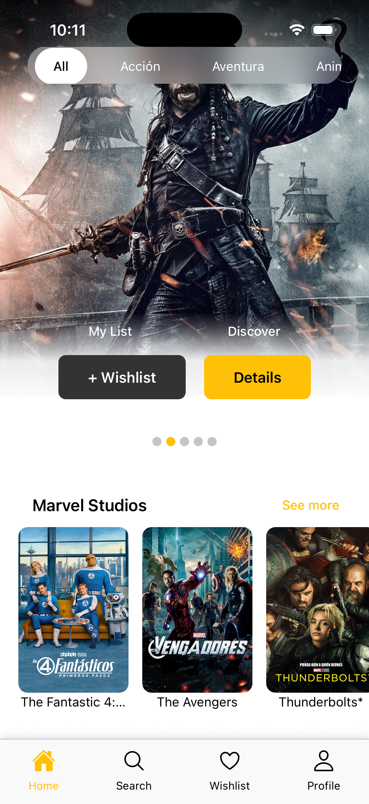
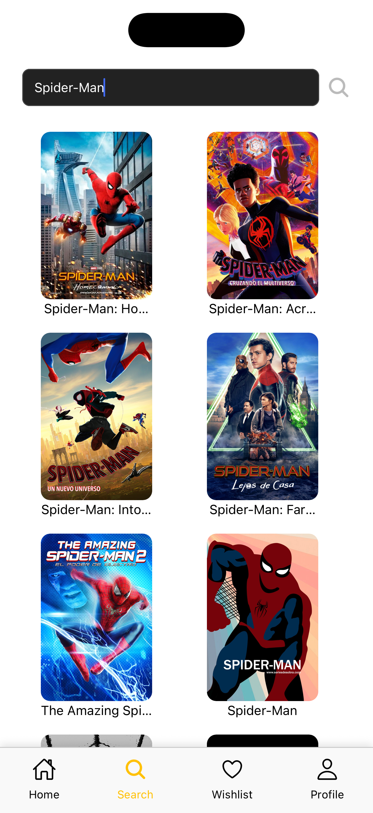
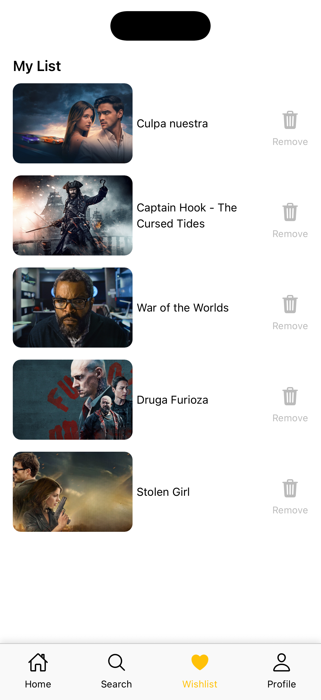
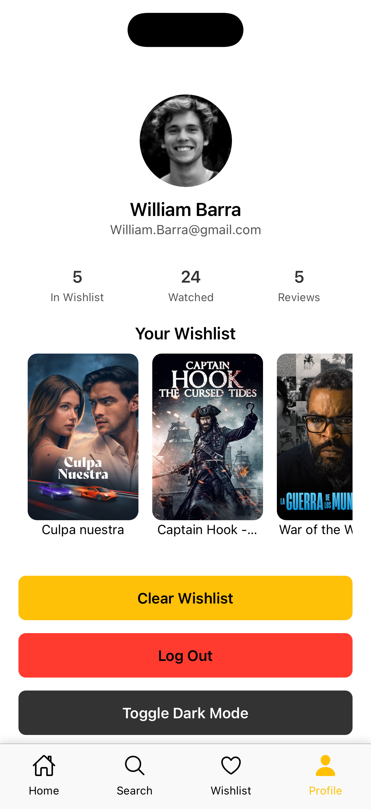
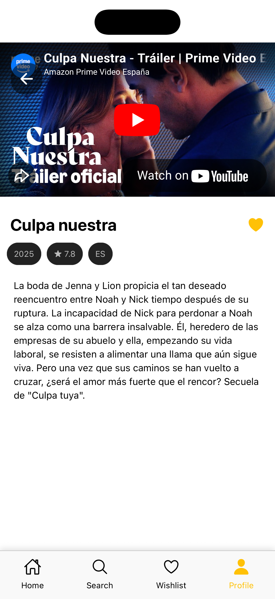
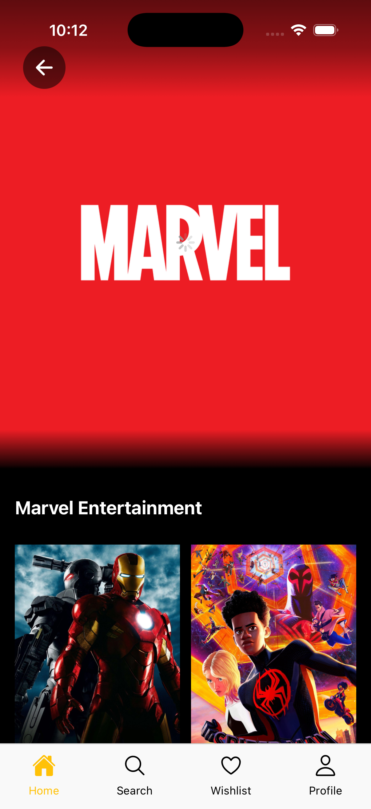

# 🎬 Movies App

A mobile app developed with **React Native CLI** that allows you to explore, search, and discover movies using the public API of **[The Movie Database (TMDB)](https://www.themoviedb.org/documentation/api)**.
Compatible with **iOS** and **Android**.

Here you can see the demo:

## 🚀 Main features

- **Search for movies** by title.
- **Movie details** (synopsis, rating, release date, cast, trailers, etc.).
- **Popular movies**, **by producer**, and **top-rated**.
- **Add to favorites or wishlist** (local persistence).

## 🎨 Design

Based on this [Figma community design](https://www.figma.com/community/file/1126286295256197533) for a modern movies mobile app (light & dark mode).

## 🛠️ Technologies used

| Category        | Technologies              |
| --------------- | ------------------------- |
| Framework       | React Native CLI          |
| Language        | TypeScript                |
| Navigation      | React Navigation          |
| HTTP Client     | Axios                     |
| API             | The Movie Database (TMDB) |
| State / Context | React Context / Hooks     |
| Design          | Atomic Design             |

---

## 📂 Project structure

Atomic Design Methodology: Atomic design is a methodology composed of five distinct stages working together to create interface design systems in a more deliberate and hierarchical manner

```bash
   src/
   ├── components/
   │ ├── atoms/
   │ ├── molecules/
   │ └── organisms/
   │
   ├── context/
   │
   ├── hooks/
   │
   ├── navigation/
   │
   ├── screens/
   │
   ├── services/
   │ ├── application/
   │ ├── domain/
   │ └── infrastructure/
```

## ⚙️ Configuration and installation

### 1. Clone the repository

```bash
git clone https://github.com/alejandroMonteroAssure/movies-app.git
cd movies-app
```

### 2. Install dependencies

```bash
npm install
# o
yarn install
```

### 3. Set up your TMDB API Key

1. Create a free account at [TMDB](https://www.themoviedb.org/).
2. Get your API key (v3).
3. Create a `.env` file in the root of the project with the following content:

   ```bash
   TMDB_ACCESS_TOKEN="YOUR_ACCESS_TOKEN"
   TMDB_API_KEY="YOUR_API_KEY"
   TMDB_BASE_URL="https://api.themoviedb.org"
   TMDB_IMAGE_BASE_URL="https://image.tmdb.org/t/p"
   ```

## 📱 Project execution

### Android

```bash
npx react-native run-android
```

### iOS

```bash
cd ios && pod install && cd ..
npx react-native run-ios
```

## 🖥️ Project execution

```bash
# Clear cache
npx react-native start --reset-cache

# Run Metro Bundler
npx react-native start

# Run linter
npm run lint

# Format with Prettier
npm run format
```

## 📸 App Screenshots

<p align="center">
  
  
  
</p>

<p align="center">
  
  
  
</p>

## 👥 Team

- Michelle Barriga
- Alejandro Montero
- Leonardo Torrico
- Mariana Vallejos
